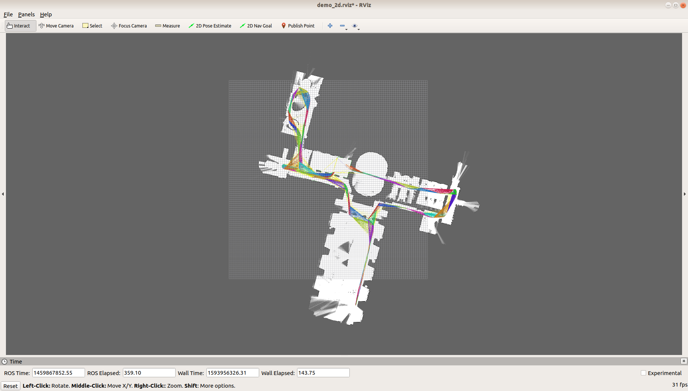

__Чтобы открыть окно полностью: Cell -> Current Outputs -> Toggle Scrolling__

__Во-первых__, я решил, пока есть время, поискать реализованные проекты симуляций со сборкой под ros.

__Во-вторых__, я увидел возможность использовать обучение для планирования пути, все можно было писать лучше знакомыми .py скриптами.

__В-третьих__, искал дополнительные инструменты для картирования. SLAM.

Из просмотренного материала попробовал интегрировать следующее:
1. [robot_training](https://github.com/Derek-TH-Wang/robot_training). Использование симуляций разных роботов и gym для демо демонстраций RL обучения. Используется, например, [fetch_tc](https://bitbucket.org/theconstructcore/fetch_tc/src/melodic-gazebo9/)

2. [hamstir_gym](https://github.com/abefetterman/hamstir-gym). Продолжая тему openAI gym. Уже большой проект. RL для робота с моно камерой в помещении (симуляция).

3. [cartographer](https://google-cartographer-ros.readthedocs.io/en/latest/). "Реал-тайм" построение 2D и 3D карт по информации с ros_msgs, .urdf файлов конфигурации робота. Работает по лазерной навигации. Подписки на топики можно контролировать с помощью .lua файлов конфигурации. В остальном - интерфейс ros.

[__robot_training__](https://github.com/Derek-TH-Wang/robot_training)

Были попытки запустить тестовые симуляции. Думаю, я не достаточно хорошо понимал, как работает обмен между процессами, что вообще стоит за кодом. Да и даже как нормально собрать проект.

Как выглядел src для catkin:

Получил, что получил и занялся следующим ресурсом.
<table><tr><td><td><td><td><tr><table>

[__hamstir_gym__](https://github.com/abefetterman/hamstir-gym)
    
В данном случае проект выглядит очень привлекательно. Сообщается, что он не готов, тем не менее видим следующие демонстрации:
    
<table><tr><td><td><td><td><tr><table>

Активно используются:
- [stable_baselines](https://pypi.org/project/stable-baselines/)
- [pybullet](https://pypi.org/project/pybullet/)
- [Gibson environment](https://github.com/StanfordVL/GibsonEnv)
    
Также нужны стандартные вещи вроде gym, tf, torch, related deps.
    
Интересна папка examples.

    
    
- Сразу сталкиваемся с проблемой совместимости с python2.7. Также для гибсона требуется RAM графики больше 6 Гб, но этим я почему то поинтересовался уже в конце. Были и другие проблемы, обычно чего то не хватало, не те версии, ее были прокинуты пути и т. д.
    
Собрал среду под третий питон, в том числе зачем то и ros. Предполагал как то соединить.
<table><tr><td><td><td><td><tr><tr><td><td><td><td><tr><table>
    
- Долго возился с пониманием работы stable_baselines. Кажется, это местный движок для RL. Кое-что понял, но почти уверен, что продвинулся только чуть.    
<table><tr><td><td><td><td><tr><table>
    

- Что касается среды.
    
По причине не очень хорошего понимания пару раз случилась большая установка-переустановка.
    
    autoremove 150 пакетов

    
Как итог после всего этого - __пришлось заново ставить ros и rtabmap__, поскольку он теперь неправильно работал, зато теперь я запомнил процесс. Приведу в конце секции.  
    
В общем был сделан разумный вывод, что с этим я не справлюсь.
    
Вспомнил, что мне нужно заниматься bag файлами, а не симуляциями в gazebo.

    
[__cartographer_ros__](https://google-cartographer-ros.readthedocs.io/en/latest/)
    
С cartographer_ros не то чтобы явная неудача, но повозиться пришлось, а в итоге большого смысла не имело, поскольку rtabmap располагает похожим функционалом.

Тем не менее, конечно есть свои плюсы. Описано в той же [статье 2D AND 3D SLAM USING RTAB-MAP GMAPPING AND CARTOGRAPHER](https://www.researchgate.net/publication/326986124_REAL-TIME_2D_AND_3D_SLAM_USING_RTAB-MAP_GMAPPING_AND_CARTOGRAPHER_PACKAGES).

Как я уже писал, были неявные ошибки билдов и, следовательно, работы. Когда и что я сломал было уже совсем не понятно. Что то странное было с rosdep. Не находил модуль rosdistro при запуске sudo, и однажды приходилось собирать "from source". Не прокатило. 

В итоге, разобравшись поболее с работой catkin, билд был наконец успешно совершен. Поставлены rtabmap и cartographer - как раз для манипуляций с записями.

__тесты__

    
__subscribe materials__

Дает понимание, с каких сенсоров приходят данные и что включать в скрипт.

__демо картирования музея__
<table><tr><td><td><td><td><tr><table>
    
Хотел показать удобство работы с инструментом, по крайней мере, на multi session. Там в записи явно виден 2D скан помещения на постоянной высоте. Так можно быстро построить карту местности, притом достаточно точно, используя submaps. Вроде бы разобрался с тем, как запускать свои bag файлы с cartographer, настроил .lua файл конфигурации - выставил subcribe на scan. Но в итоге получил только одометрию самого робота. Никаких, к сожалению, лучей.
    
Было уже не так много времени и этот подход так же ушел на списание.

- Были и прочие проблемы, кажется я и так много написал. Оставлю напоследок свои "журналы".
