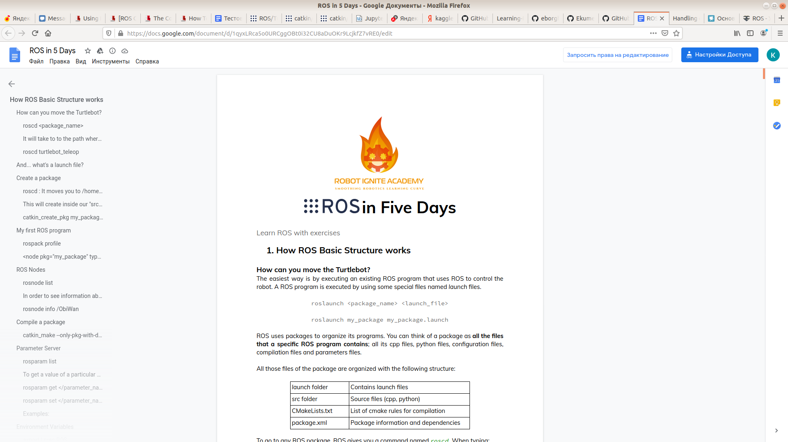
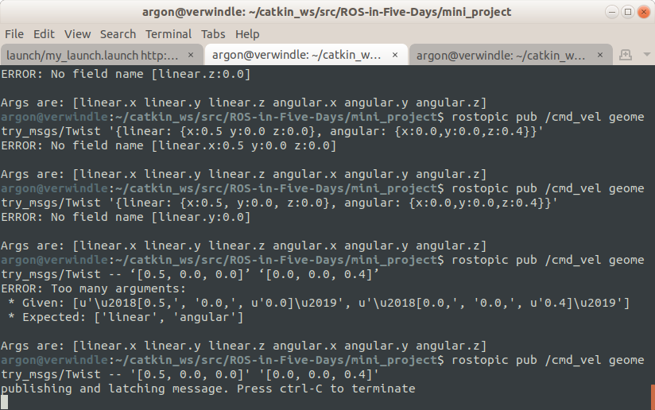

Курс пройден несколько лет назад на питоне. В общем то, после него я и открыл для себя магию catkin.

Нет .bag файлов, то есть код с github работает, но сервисов у нас нет. Но все равно само прочтение дока полезно, плюс проверка кода.

Описаны топики, сервисы, мессэджи и т.д. Визуализация и каткин мэйк. Действительно полезно и не слишком много.

Наверное, это вместо вот [этого большого пути](http://wiki.ros.org/ROS/Tutorials#ROS_Tutorials).

__Док, что можем без rviz (message to server) и node info__ для turtle.

<table><tr><td><td><td>
<td><td>
<td><tr><table>    
